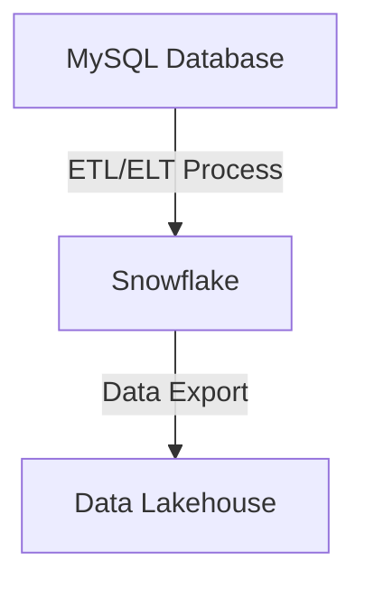

# llm-agent

```
docker pull ollama/ollama
docker run -d -v ollama:/root/.ollama -p 11434:11434 --name ollama ollama/ollama
docker exec -it ollama ollama pull llama3.1:8b     
python3 -m venv .venv
source .venv/bin/activate
```


